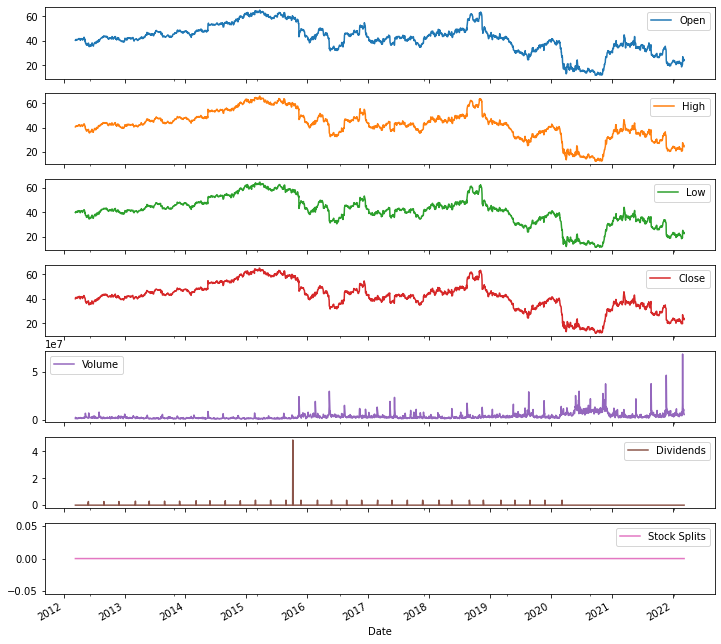
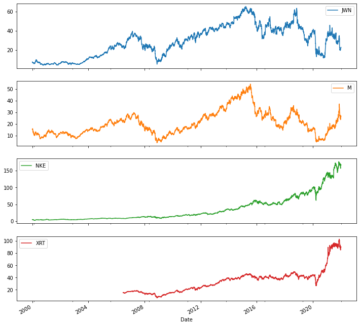
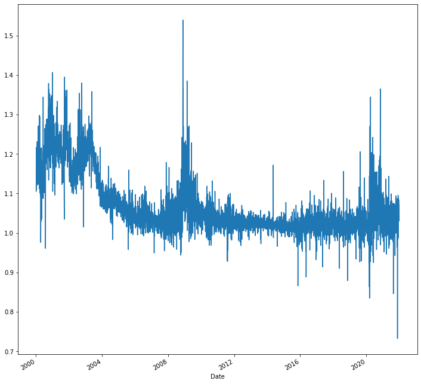
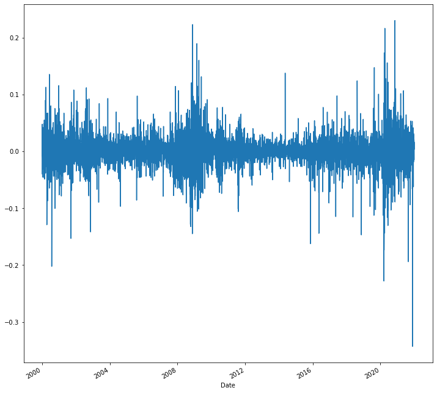
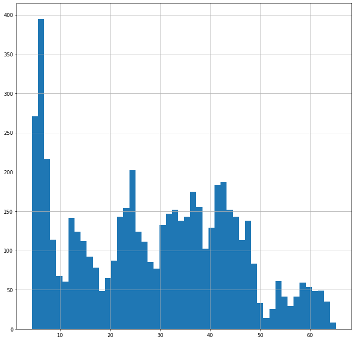

```python
import pandas as pd
import numpy as np
import seaborn as sns
import matplotlib as plt
%matplotlib inline
```


```python
!pip install yfinance
```

    Requirement already satisfied: yfinance in ./opt/anaconda3/lib/python3.9/site-packages (0.1.70)
    Requirement already satisfied: pandas>=0.24.0 in ./opt/anaconda3/lib/python3.9/site-packages (from yfinance) (1.4.1)
    Requirement already satisfied: numpy>=1.15 in ./opt/anaconda3/lib/python3.9/site-packages (from yfinance) (1.20.3)
    Requirement already satisfied: multitasking>=0.0.7 in ./opt/anaconda3/lib/python3.9/site-packages (from yfinance) (0.0.10)
    Requirement already satisfied: requests>=2.26 in ./opt/anaconda3/lib/python3.9/site-packages (from yfinance) (2.26.0)
    Requirement already satisfied: lxml>=4.5.1 in ./opt/anaconda3/lib/python3.9/site-packages (from yfinance) (4.6.3)
    Requirement already satisfied: pytz>=2020.1 in ./opt/anaconda3/lib/python3.9/site-packages (from pandas>=0.24.0->yfinance) (2021.3)
    Requirement already satisfied: python-dateutil>=2.8.1 in ./opt/anaconda3/lib/python3.9/site-packages (from pandas>=0.24.0->yfinance) (2.8.2)
    Requirement already satisfied: six>=1.5 in ./opt/anaconda3/lib/python3.9/site-packages (from python-dateutil>=2.8.1->pandas>=0.24.0->yfinance) (1.16.0)
    Requirement already satisfied: charset-normalizer~=2.0.0 in ./opt/anaconda3/lib/python3.9/site-packages (from requests>=2.26->yfinance) (2.0.4)
    Requirement already satisfied: urllib3<1.27,>=1.21.1 in ./opt/anaconda3/lib/python3.9/site-packages (from requests>=2.26->yfinance) (1.26.7)
    Requirement already satisfied: idna<4,>=2.5 in ./opt/anaconda3/lib/python3.9/site-packages (from requests>=2.26->yfinance) (3.2)
    Requirement already satisfied: certifi>=2017.4.17 in ./opt/anaconda3/lib/python3.9/site-packages (from requests>=2.26->yfinance) (2021.10.8)


```python
import yfinance as yf
```


```python
JWN = yf.Ticker("JWN")
```


```python
JWN.info
```


    {'zip': '98101',
     'sector': 'Consumer Cyclical',
     'fullTimeEmployees': 72000,
     'longBusinessSummary': 'Nordstrom, Inc., a fashion retailer, provides apparels, shoes, beauty, accessories, and home goods for women, men, young adults, and children. It offers a range of brand name and private label merchandise through various channels, such as Nordstrom branded stores and online at Nordstrom.com; TrunkClub.com; Nordstrom.ca; Nordstrom stores; Nordstrom Rack stores; Nordstrom Locals; Nordstromrack.com, and HauteLook; clearance stores under the Last Chance name; Trunk Club clubhouses; and Jeffrey boutiques. As of March 02, 2021, it operated 358 stores in the U.S. and Canada, including 100 Nordstrom stores, 249 Nordstrom Rack stores, 2 clearance stores, and 7 Nordstrom Local service hubs. The company was founded in 1901 and is headquartered in Seattle, Washington.',
     'city': 'Seattle',
     'phone': '206 628 2111',
     'state': 'WA',
     'country': 'United States',
     'companyOfficers': [],
     'website': 'https://press.nordstrom.com',
     'maxAge': 1,
     'address1': '1617 Sixth Avenue',
     'industry': 'Department Stores',
     'ebitdaMargins': 0.07485,
     'profitMargins': 0.01204,
     'grossMargins': 0.36818,
     'operatingCashflow': 705000000,
     'revenueGrowth': 0.231,
     'operatingMargins': 0.033269998,
     'ebitda': 1107000064,
     'targetLowPrice': 12,
     'recommendationKey': 'hold',
     'grossProfits': 5445000000,
     'freeCashflow': 394124992,
     'targetMedianPrice': 27,
     'currentPrice': 22.99,
     'earningsGrowth': 5.205,
     'currentRatio': 0.957,
     'returnOnAssets': 0.03341,
     'numberOfAnalystOpinions': 14,
     'targetMeanPrice': 25.93,
     'debtToEquity': 800.516,
     'returnOnEquity': 0.40181,
     'targetHighPrice': 31,
     'totalCash': 322000000,
     'totalDebt': 4650999808,
     'totalRevenue': 14789000192,
     'totalCashPerShare': 2.02,
     'financialCurrency': 'USD',
     'revenuePerShare': 93.013,
     'quickRatio': 0.174,
     'recommendationMean': 3.4,
     'exchange': 'NYQ',
     'shortName': 'Nordstrom, Inc.',
     'longName': 'Nordstrom, Inc.',
     'exchangeTimezoneName': 'America/New_York',
     'exchangeTimezoneShortName': 'EDT',
     'isEsgPopulated': False,
     'gmtOffSetMilliseconds': '-14400000',
     'quoteType': 'EQUITY',
     'symbol': 'JWN',
     'messageBoardId': 'finmb_32215',
     'market': 'us_market',
     'annualHoldingsTurnover': None,
     'enterpriseToRevenue': 0.541,
     'beta3Year': None,
     'enterpriseToEbitda': 7.221,
     '52WeekChange': -0.49792528,
     'morningStarRiskRating': None,
     'forwardEps': 3.34,
     'revenueQuarterlyGrowth': None,
     'sharesOutstanding': 159400000,
     'fundInceptionDate': None,
     'annualReportExpenseRatio': None,
     'totalAssets': None,
     'bookValue': 3.645,
     'sharesShort': 28333065,
     'sharesPercentSharesOut': 0.1777,
     'fundFamily': None,
     'lastFiscalYearEnd': 1643414400,
     'heldPercentInstitutions': 0.59158003,
     'netIncomeToCommon': 178000000,
     'trailingEps': 1.1,
     'lastDividendValue': 0.37,
     'SandP52WeekChange': 0.059303045,
     'priceToBook': 6.30727,
     'heldPercentInsiders': 0.2942,
     'nextFiscalYearEnd': 1706486400,
     'yield': None,
     'mostRecentQuarter': 1643414400,
     'shortRatio': 5.67,
     'sharesShortPreviousMonthDate': 1643587200,
     'floatShares': 111344688,
     'beta': 2.345472,
     'enterpriseValue': 7993573376,
     'priceHint': 2,
     'threeYearAverageReturn': None,
     'lastSplitDate': 1120176000,
     'lastSplitFactor': '2:1',
     'legalType': None,
     'lastDividendDate': 1583712000,
     'morningStarOverallRating': None,
     'earningsQuarterlyGrowth': 5.061,
     'priceToSalesTrailing12Months': 0.24779268,
     'dateShortInterest': 1646006400,
     'pegRatio': 0.19,
     'ytdReturn': None,
     'forwardPE': 6.8832335,
     'lastCapGain': None,
     'shortPercentOfFloat': 0.2226,
     'sharesShortPriorMonth': 22790297,
     'impliedSharesOutstanding': 0,
     'category': None,
     'fiveYearAverageReturn': None,
     'previousClose': 23.96,
     'regularMarketOpen': 24.03,
     'twoHundredDayAverage': 28.2507,
     'trailingAnnualDividendYield': 0,
     'payoutRatio': 0,
     'volume24Hr': None,
     'regularMarketDayHigh': 24.2,
     'navPrice': None,
     'averageDailyVolume10Day': 15838480,
     'regularMarketPreviousClose': 23.96,
     'fiftyDayAverage': 22.524,
     'trailingAnnualDividendRate': 0,
     'open': 24.03,
     'toCurrency': None,
     'averageVolume10days': 15838480,
     'expireDate': None,
     'algorithm': None,
     'dividendRate': None,
     'exDividendDate': 1583712000,
     'circulatingSupply': None,
     'startDate': None,
     'regularMarketDayLow': 22.84,
     'currency': 'USD',
     'trailingPE': 20.9,
     'regularMarketVolume': 5212390,
     'lastMarket': None,
     'maxSupply': None,
     'openInterest': None,
     'marketCap': 3664605952,
     'volumeAllCurrencies': None,
     'strikePrice': None,
     'averageVolume': 6848866,
     'dayLow': 22.84,
     'ask': 23.28,
     'askSize': 1000,
     'volume': 5212390,
     'fiftyTwoWeekHigh': 46.45,
     'fromCurrency': None,
     'fiveYearAvgDividendYield': None,
     'fiftyTwoWeekLow': 18.65,
     'bid': 22.94,
     'tradeable': False,
     'dividendYield': None,
     'bidSize': 1400,
     'dayHigh': 24.2,
     'regularMarketPrice': 22.99,
     'preMarketPrice': None,
     'logo_url': 'https://logo.clearbit.com/press.nordstrom.com',
     'trailingPegRatio': 2.0461}


```python
hist = JWN.history(period="10y")
```


```python
hist
```


<div>
<style scoped>
    .dataframe tbody tr th:only-of-type {
        vertical-align: middle;
    }

    .dataframe tbody tr th {
        vertical-align: top;
    }

    .dataframe thead th {
        text-align: right;
    }
</style>
<table border="1" class="dataframe">
  <thead>
    <tr style="text-align: right;">
      <th></th>
      <th>Open</th>
      <th>High</th>
      <th>Low</th>
      <th>Close</th>
      <th>Volume</th>
      <th>Dividends</th>
      <th>Stock Splits</th>
    </tr>
    <tr>
      <th>Date</th>
      <th></th>
      <th></th>
      <th></th>
      <th></th>
      <th></th>
      <th></th>
      <th></th>
    </tr>
  </thead>
  <tbody>
    <tr>
      <th>2012-03-12</th>
      <td>40.441748</td>
      <td>40.553755</td>
      <td>39.986255</td>
      <td>40.075859</td>
      <td>1052800</td>
      <td>0.0</td>
      <td>0</td>
    </tr>
    <tr>
      <th>2012-03-13</th>
      <td>40.277485</td>
      <td>41.031662</td>
      <td>39.695053</td>
      <td>40.994328</td>
      <td>2266600</td>
      <td>0.0</td>
      <td>0</td>
    </tr>
    <tr>
      <th>2012-03-14</th>
      <td>40.807647</td>
      <td>41.054060</td>
      <td>40.613501</td>
      <td>40.830048</td>
      <td>1215200</td>
      <td>0.0</td>
      <td>0</td>
    </tr>
    <tr>
      <th>2012-03-15</th>
      <td>40.800173</td>
      <td>41.158593</td>
      <td>40.494022</td>
      <td>41.106323</td>
      <td>1612900</td>
      <td>0.0</td>
      <td>0</td>
    </tr>
    <tr>
      <th>2012-03-16</th>
      <td>41.151128</td>
      <td>41.337805</td>
      <td>40.673235</td>
      <td>40.979385</td>
      <td>1823100</td>
      <td>0.0</td>
      <td>0</td>
    </tr>
    <tr>
      <th>...</th>
      <td>...</td>
      <td>...</td>
      <td>...</td>
      <td>...</td>
      <td>...</td>
      <td>...</td>
      <td>...</td>
    </tr>
    <tr>
      <th>2022-03-07</th>
      <td>24.309999</td>
      <td>24.870001</td>
      <td>23.129999</td>
      <td>23.430000</td>
      <td>9193100</td>
      <td>0.0</td>
      <td>0</td>
    </tr>
    <tr>
      <th>2022-03-08</th>
      <td>23.660000</td>
      <td>25.549999</td>
      <td>23.129999</td>
      <td>24.360001</td>
      <td>10678600</td>
      <td>0.0</td>
      <td>0</td>
    </tr>
    <tr>
      <th>2022-03-09</th>
      <td>25.000000</td>
      <td>25.459999</td>
      <td>23.980000</td>
      <td>24.020000</td>
      <td>6306100</td>
      <td>0.0</td>
      <td>0</td>
    </tr>
    <tr>
      <th>2022-03-10</th>
      <td>23.990000</td>
      <td>24.530001</td>
      <td>23.290001</td>
      <td>23.959999</td>
      <td>5205600</td>
      <td>0.0</td>
      <td>0</td>
    </tr>
    <tr>
      <th>2022-03-11</th>
      <td>24.030001</td>
      <td>24.200001</td>
      <td>22.840000</td>
      <td>22.990000</td>
      <td>5209900</td>
      <td>0.0</td>
      <td>0</td>
    </tr>
  </tbody>
</table>
<p>2518 rows × 7 columns</p>
</div>


```python
hist.plot(kind="line", figsize=(12, 12), subplots=True);
```


    

    


```python
ticker_list = ["JWN","XRT","M","NKE"]
```


```python
df =  yf.download(ticker_list,period="m",start="2000-1-1", end="2022-1-1")
```

    [*********************100%***********************]  4 of 4 completed


```python
df
```


<div>
<style scoped>
    .dataframe tbody tr th:only-of-type {
        vertical-align: middle;
    }

    .dataframe tbody tr th {
        vertical-align: top;
    }

    .dataframe thead tr th {
        text-align: left;
    }

    .dataframe thead tr:last-of-type th {
        text-align: right;
    }
</style>
<table border="1" class="dataframe">
  <thead>
    <tr>
      <th></th>
      <th colspan="4" halign="left">Adj Close</th>
      <th colspan="4" halign="left">Close</th>
      <th colspan="2" halign="left">High</th>
      <th>...</th>
      <th colspan="2" halign="left">Low</th>
      <th colspan="4" halign="left">Open</th>
      <th colspan="4" halign="left">Volume</th>
    </tr>
    <tr>
      <th></th>
      <th>JWN</th>
      <th>M</th>
      <th>NKE</th>
      <th>XRT</th>
      <th>JWN</th>
      <th>M</th>
      <th>NKE</th>
      <th>XRT</th>
      <th>JWN</th>
      <th>M</th>
      <th>...</th>
      <th>NKE</th>
      <th>XRT</th>
      <th>JWN</th>
      <th>M</th>
      <th>NKE</th>
      <th>XRT</th>
      <th>JWN</th>
      <th>M</th>
      <th>NKE</th>
      <th>XRT</th>
    </tr>
    <tr>
      <th>Date</th>
      <th></th>
      <th></th>
      <th></th>
      <th></th>
      <th></th>
      <th></th>
      <th></th>
      <th></th>
      <th></th>
      <th></th>
      <th></th>
      <th></th>
      <th></th>
      <th></th>
      <th></th>
      <th></th>
      <th></th>
      <th></th>
      <th></th>
      <th></th>
      <th></th>
    </tr>
  </thead>
  <tbody>
    <tr>
      <th>2000-01-03</th>
      <td>7.681508</td>
      <td>15.328801</td>
      <td>4.754893</td>
      <td>NaN</td>
      <td>12.875000</td>
      <td>25.187500</td>
      <td>6.015625</td>
      <td>NaN</td>
      <td>13.187500</td>
      <td>25.531250</td>
      <td>...</td>
      <td>5.968750</td>
      <td>NaN</td>
      <td>13.093750</td>
      <td>25.125000</td>
      <td>6.164063</td>
      <td>NaN</td>
      <td>882200</td>
      <td>2493200</td>
      <td>8014400</td>
      <td>NaN</td>
    </tr>
    <tr>
      <th>2000-01-04</th>
      <td>7.383191</td>
      <td>14.891376</td>
      <td>4.495537</td>
      <td>NaN</td>
      <td>12.375000</td>
      <td>24.468750</td>
      <td>5.687500</td>
      <td>NaN</td>
      <td>12.750000</td>
      <td>24.875000</td>
      <td>...</td>
      <td>5.671875</td>
      <td>NaN</td>
      <td>12.625000</td>
      <td>24.687500</td>
      <td>5.875000</td>
      <td>NaN</td>
      <td>696800</td>
      <td>1527000</td>
      <td>9810400</td>
      <td>NaN</td>
    </tr>
    <tr>
      <th>2000-01-05</th>
      <td>7.252680</td>
      <td>15.176648</td>
      <td>4.754893</td>
      <td>NaN</td>
      <td>12.156250</td>
      <td>24.937500</td>
      <td>6.015625</td>
      <td>NaN</td>
      <td>12.468750</td>
      <td>25.000000</td>
      <td>...</td>
      <td>5.718750</td>
      <td>NaN</td>
      <td>12.343750</td>
      <td>24.562500</td>
      <td>5.718750</td>
      <td>NaN</td>
      <td>556200</td>
      <td>1755400</td>
      <td>6542400</td>
      <td>NaN</td>
    </tr>
    <tr>
      <th>2000-01-06</th>
      <td>7.606926</td>
      <td>15.043523</td>
      <td>4.730192</td>
      <td>NaN</td>
      <td>12.750000</td>
      <td>24.718750</td>
      <td>5.984375</td>
      <td>NaN</td>
      <td>12.968750</td>
      <td>25.000000</td>
      <td>...</td>
      <td>5.820313</td>
      <td>NaN</td>
      <td>12.312500</td>
      <td>25.000000</td>
      <td>5.984375</td>
      <td>NaN</td>
      <td>1264800</td>
      <td>1663200</td>
      <td>4891200</td>
      <td>NaN</td>
    </tr>
    <tr>
      <th>2000-01-07</th>
      <td>7.606926</td>
      <td>15.461926</td>
      <td>4.730192</td>
      <td>NaN</td>
      <td>12.750000</td>
      <td>25.406250</td>
      <td>5.984375</td>
      <td>NaN</td>
      <td>13.187500</td>
      <td>25.500000</td>
      <td>...</td>
      <td>5.875000</td>
      <td>NaN</td>
      <td>13.125000</td>
      <td>24.625000</td>
      <td>5.960938</td>
      <td>NaN</td>
      <td>869800</td>
      <td>2078400</td>
      <td>3993600</td>
      <td>NaN</td>
    </tr>
    <tr>
      <th>...</th>
      <td>...</td>
      <td>...</td>
      <td>...</td>
      <td>...</td>
      <td>...</td>
      <td>...</td>
      <td>...</td>
      <td>...</td>
      <td>...</td>
      <td>...</td>
      <td>...</td>
      <td>...</td>
      <td>...</td>
      <td>...</td>
      <td>...</td>
      <td>...</td>
      <td>...</td>
      <td>...</td>
      <td>...</td>
      <td>...</td>
      <td>...</td>
    </tr>
    <tr>
      <th>2021-12-27</th>
      <td>22.150000</td>
      <td>25.809999</td>
      <td>167.198486</td>
      <td>89.760002</td>
      <td>22.150000</td>
      <td>25.809999</td>
      <td>167.580002</td>
      <td>89.760002</td>
      <td>22.680000</td>
      <td>26.129999</td>
      <td>...</td>
      <td>165.479996</td>
      <td>88.430000</td>
      <td>21.780001</td>
      <td>25.049999</td>
      <td>166.520004</td>
      <td>88.830002</td>
      <td>4168700</td>
      <td>14038000</td>
      <td>3769300</td>
      <td>2525900.0</td>
    </tr>
    <tr>
      <th>2021-12-28</th>
      <td>22.219999</td>
      <td>26.049999</td>
      <td>166.041122</td>
      <td>89.330002</td>
      <td>22.219999</td>
      <td>26.049999</td>
      <td>166.419998</td>
      <td>89.330002</td>
      <td>22.760000</td>
      <td>26.760000</td>
      <td>...</td>
      <td>166.300003</td>
      <td>89.239998</td>
      <td>22.100000</td>
      <td>25.629999</td>
      <td>167.800003</td>
      <td>89.510002</td>
      <td>3620000</td>
      <td>16388400</td>
      <td>2658600</td>
      <td>2116400.0</td>
    </tr>
    <tr>
      <th>2021-12-29</th>
      <td>22.590000</td>
      <td>26.980000</td>
      <td>168.395737</td>
      <td>89.849998</td>
      <td>22.590000</td>
      <td>26.980000</td>
      <td>168.779999</td>
      <td>89.849998</td>
      <td>22.879999</td>
      <td>27.350000</td>
      <td>...</td>
      <td>166.600006</td>
      <td>89.010002</td>
      <td>22.420000</td>
      <td>26.030001</td>
      <td>167.070007</td>
      <td>89.449997</td>
      <td>3438900</td>
      <td>14196000</td>
      <td>3830900</td>
      <td>2416000.0</td>
    </tr>
    <tr>
      <th>2021-12-30</th>
      <td>22.950001</td>
      <td>26.840000</td>
      <td>167.108688</td>
      <td>90.860001</td>
      <td>22.950001</td>
      <td>26.840000</td>
      <td>167.490005</td>
      <td>90.860001</td>
      <td>23.510000</td>
      <td>27.270000</td>
      <td>...</td>
      <td>167.199997</td>
      <td>89.860001</td>
      <td>22.459999</td>
      <td>26.730000</td>
      <td>168.309998</td>
      <td>89.860001</td>
      <td>4525600</td>
      <td>12844900</td>
      <td>2666800</td>
      <td>1894500.0</td>
    </tr>
    <tr>
      <th>2021-12-31</th>
      <td>22.620001</td>
      <td>26.180000</td>
      <td>166.290543</td>
      <td>90.290001</td>
      <td>22.620001</td>
      <td>26.180000</td>
      <td>166.669998</td>
      <td>90.290001</td>
      <td>23.230000</td>
      <td>27.190001</td>
      <td>...</td>
      <td>166.210007</td>
      <td>89.970001</td>
      <td>22.820000</td>
      <td>26.780001</td>
      <td>167.559998</td>
      <td>90.540001</td>
      <td>3801700</td>
      <td>9691500</td>
      <td>2752000</td>
      <td>2820400.0</td>
    </tr>
  </tbody>
</table>
<p>5536 rows × 24 columns</p>
</div>


```python
df.columns
```


    MultiIndex([('Adj Close', 'JWN'),
                ('Adj Close',   'M'),
                ('Adj Close', 'NKE'),
                ('Adj Close', 'XRT'),
                (    'Close', 'JWN'),
                (    'Close',   'M'),
                (    'Close', 'NKE'),
                (    'Close', 'XRT'),
                (     'High', 'JWN'),
                (     'High',   'M'),
                (     'High', 'NKE'),
                (     'High', 'XRT'),
                (      'Low', 'JWN'),
                (      'Low',   'M'),
                (      'Low', 'NKE'),
                (      'Low', 'XRT'),
                (     'Open', 'JWN'),
                (     'Open',   'M'),
                (     'Open', 'NKE'),
                (     'Open', 'XRT'),
                (   'Volume', 'JWN'),
                (   'Volume',   'M'),
                (   'Volume', 'NKE'),
                (   'Volume', 'XRT')],
               )


```python
adj_close = df.dropna(thresh=10,axis=1)['Adj Close']
```


```python
adj_close.head()
```


<div>
<style scoped>
    .dataframe tbody tr th:only-of-type {
        vertical-align: middle;
    }

    .dataframe tbody tr th {
        vertical-align: top;
    }

    .dataframe thead th {
        text-align: right;
    }
</style>
<table border="1" class="dataframe">
  <thead>
    <tr style="text-align: right;">
      <th></th>
      <th>JWN</th>
      <th>M</th>
      <th>NKE</th>
      <th>XRT</th>
    </tr>
    <tr>
      <th>Date</th>
      <th></th>
      <th></th>
      <th></th>
      <th></th>
    </tr>
  </thead>
  <tbody>
    <tr>
      <th>2000-01-03</th>
      <td>7.681508</td>
      <td>15.328801</td>
      <td>4.754893</td>
      <td>NaN</td>
    </tr>
    <tr>
      <th>2000-01-04</th>
      <td>7.383191</td>
      <td>14.891376</td>
      <td>4.495537</td>
      <td>NaN</td>
    </tr>
    <tr>
      <th>2000-01-05</th>
      <td>7.252680</td>
      <td>15.176648</td>
      <td>4.754893</td>
      <td>NaN</td>
    </tr>
    <tr>
      <th>2000-01-06</th>
      <td>7.606926</td>
      <td>15.043523</td>
      <td>4.730192</td>
      <td>NaN</td>
    </tr>
    <tr>
      <th>2000-01-07</th>
      <td>7.606926</td>
      <td>15.461926</td>
      <td>4.730192</td>
      <td>NaN</td>
    </tr>
  </tbody>
</table>
</div>


```python
adj_close.describe().T
```


<div>
<style scoped>
    .dataframe tbody tr th:only-of-type {
        vertical-align: middle;
    }

    .dataframe tbody tr th {
        vertical-align: top;
    }

    .dataframe thead th {
        text-align: right;
    }
</style>
<table border="1" class="dataframe">
  <thead>
    <tr style="text-align: right;">
      <th></th>
      <th>count</th>
      <th>mean</th>
      <th>std</th>
      <th>min</th>
      <th>25%</th>
      <th>50%</th>
      <th>75%</th>
      <th>max</th>
    </tr>
  </thead>
  <tbody>
    <tr>
      <th>JWN</th>
      <td>5536.0</td>
      <td>28.898566</td>
      <td>16.092857</td>
      <td>4.323335</td>
      <td>13.979434</td>
      <td>29.914798</td>
      <td>41.711531</td>
      <td>65.242477</td>
    </tr>
    <tr>
      <th>M</th>
      <td>5536.0</td>
      <td>20.584462</td>
      <td>10.393251</td>
      <td>3.734624</td>
      <td>12.748388</td>
      <td>18.320392</td>
      <td>26.631634</td>
      <td>54.261044</td>
    </tr>
    <tr>
      <th>NKE</th>
      <td>5536.0</td>
      <td>35.127260</td>
      <td>37.910088</td>
      <td>2.624455</td>
      <td>8.398891</td>
      <td>17.905196</td>
      <td>52.316535</td>
      <td>176.788116</td>
    </tr>
    <tr>
      <th>XRT</th>
      <td>3910.0</td>
      <td>34.228611</td>
      <td>19.135515</td>
      <td>6.376957</td>
      <td>17.832365</td>
      <td>36.862892</td>
      <td>42.086991</td>
      <td>103.055542</td>
    </tr>
  </tbody>
</table>
</div>


```python
adj_close.plot(figsize=(12, 12), subplots=True);


```


    

    


```python
JWN = adj_close['JWN']
```


```python
JWN.resample("4M").mean()
```


    Date
    2000-01-31     7.006575
    2000-05-31     7.663064
    2000-09-30     6.211453
    2001-01-31     5.131464
    2001-05-31     5.499498
                    ...    
    2020-09-30    15.794535
    2021-01-31    24.311928
    2021-05-31    37.476627
    2021-09-30    32.625581
    2022-01-31    26.497969
    Freq: 4M, Name: JWN, Length: 67, dtype: float64


```python
JWN_per_change = JWN / (JWN.shift(1) - 1)
```


```python
JWN_per_change.plot(figsize=(12, 12))
```


    <AxesSubplot:xlabel='Date'>


    

    


```python
JWN_log_returns_shift = np.log(JWN/JWN.shift(1))
```


```python
JWN_log_returns_shift.plot(figsize=(12,12));
```


    

    


```python
JWN.hist(bins=50, figsize=(12,12));
```


    

    


```python

```
